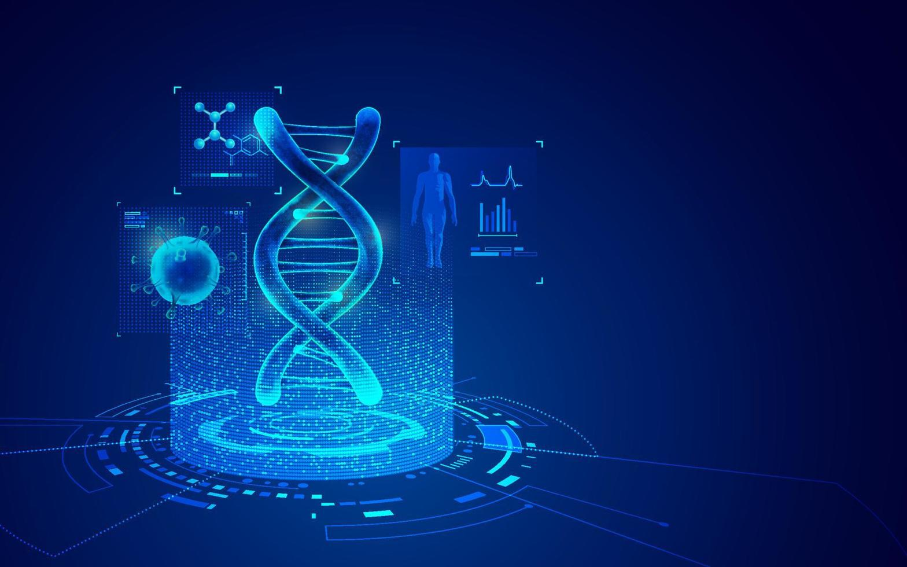
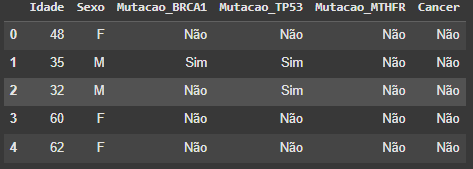
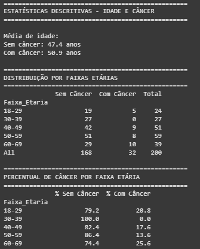
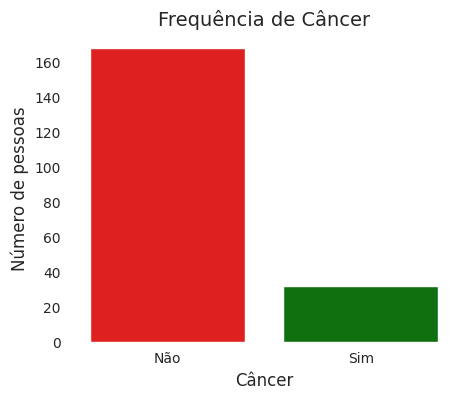
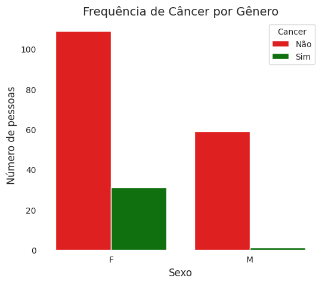
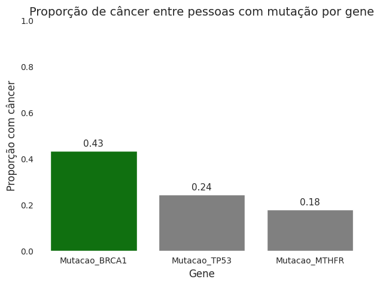
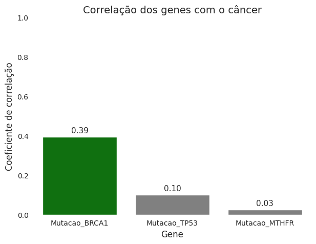

# 🧬 Bioinformática na prática: Genes e Câncer de Mama/Ovário

---

## 📌 Sobre o Projeto
Trabalho proposto pela **professora de Biologia da FUNEC Inconfidentes**, com o objetivo de mostrar de forma prática como a **Bioinformática e a Ciência de Dados** podem ajudar a compreender doenças como o **câncer de mama e ovário**.  

---

## 🎯 Objetivos
- Criar dados simulados de **200 pessoas** (idade, gênero e mutações nos genes BRCA1, TP53 e MTHFR).  
- Analisar a distribuição de idade, frequência de mutações e ocorrência de câncer.  
- Avaliar riscos por gênero e faixa etária.  
- Investigar correlações entre genes, idade e câncer.  
- Gerar **gráficos e tabelas modernos** para facilitar a interpretação.  

---

## 🛠️ Tecnologias Utilizadas
- **Python** 🐍  
- **Pandas** 📊 (análise de dados)  
- **Seaborn** 🎨 (visualização de dados)  
- **Jupyter Notebook** 📓 (códigos + gráficos + explicações)  

---

## 🔎 Etapas do Trabalho
1. **Preparação dos dados** → Simulação das informações de 200 pessoas.  
   

2. **Análise exploratória** → Idade média, distribuição por gênero e mutações.  

3. **Correlação** → Relação entre genes, idade e risco de câncer.  

4. **Visualização** → Gráficos minimalistas para facilitar a compreensão.  

---

## 📊 Principais Análises
- Idade média de pessoas com e sem câncer.  
- Frequência de mutações.  
- Proporção de câncer por gênero e faixa etária.  
- Correlação entre idade, mutações e ocorrência de câncer.  

---

## 🧾 Genes Estudados

| Gene      | Função Normal 🧩                                                                 | O que acontece na Mutação ⚠️           | Consequências Principais 🩺                                                                                       |
|-----------|----------------------------------------------------------------------------------|-----------------------------------------|-------------------------------------------------------------------------------------------------------------------|
| **BRCA1** 🧬 | Repara danos no DNA e mantém a **estabilidade do genoma**                      | Perde a capacidade de corrigir erros no DNA | Aumenta muito o risco de **câncer de mama, ovário e próstata**. Associado a histórico familiar de câncer hereditário |
| **TP53** 🔒 | Produz a proteína **p53**, conhecida como “guardião do genoma”, que bloqueia células defeituosas | Células danificadas não são eliminadas | Presente em mais de **50% dos cânceres humanos**. Mutação favorece o crescimento descontrolado de tumores           |
| **MTHFR** 🌱 | Atua no metabolismo do **ácido fólico** e regula os níveis de **homocisteína** | Dificuldades no metabolismo das vitaminas | Pode gerar **homocisteína alta**, aumentando risco de **trombose, doenças cardiovasculares e complicações na gravidez** |

---

## 📸 Referências Visuais
- Faixa Etária  
    

- Frequência de Câncer  
    

- Distribuição por Gênero  
    

- Proporção por mutação  
    

- Correlação genes x câncer  
    

---

## 🚀 Como Executar
1. Abra no **Jupyter Notebook** ou **Google Colab**.  
2. Execute as células na ordem.  
3. Os códigos irão gerar automaticamente **tabelas, estatísticas e gráficos**.  
4. Substitua dados ou imagens caso queira expandir o estudo.  

---

## ✅ Conclusão
O projeto mostrou como a **Bioinformática transforma dados genéticos em informação prática**, auxiliando na prevenção e no monitoramento de doenças.  

📌 Destaque: a mutação **BRCA1** apresentou maior associação ao câncer de mama/ovário, reforçando a importância do monitoramento genético.  

---

## 👥 Integrantes
- Miguel  
- Emmilly  
- Vinicius  
- Maria Luiza  
- Rute  

---

**"A educação é a arma mais poderosa que você pode usar para mudar o mundo." – Nelson Mandela**
